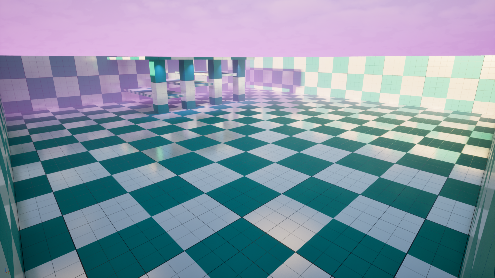

# Simple First Person Template

A lightweight and customizable first-person movement template for Unreal Engine 5.6.



## Overview

This template provides a solid foundation for first-person games with a complete movement system including walking, sprinting, crouching, and jumping. Built with Unreal Engine's Enhanced Input System, it's designed to be easily customizable and extended for your game projects.

## Features

- **Complete First-Person Movement System**
  - Walk and run mechanics
  - Sprint with configurable speed multiplier
  - Crouch with smooth camera transitions
  - Jump functionality
  - Fully customizable movement parameters

- **Enhanced Input System**
  - Modern UE5 Input Action system
  - Input Mapping Context for easy remapping
  - Customizable sensitivity for look controls

- **Camera System**
  - Smooth camera animations for crouch/uncrouch
  - Configurable vertical and horizontal look sensitivity
  - Integrated first-person camera component

- **Developer-Friendly**
  - Clean, well-commented C++ code
  - Blueprint-accessible properties
  - Easy to extend and customize
  - Demo map included for testing

## Requirements

- Unreal Engine 5.6 or later
- Visual Studio 2022 (for C++ development)
- Windows 10/11 (64-bit)

## Getting Started

### Installation

1. Clone this repository:
   ```bash
   git clone <repository-url>
   ```

2. Right-click on `TP_SimpleFirstPerson.uproject` and select "Generate Visual Studio project files"

3. Open the generated `.sln` file in Visual Studio

4. Build the project (F7)

5. Launch the project by opening `TP_SimpleFirstPerson.uproject`

### Quick Start

1. Open the Demo map located at `Content/Demo/Maps/Demo.umap`
2. Press Play (Alt+P) to test the character
3. Use WASD to move, Space to jump, Left Shift to sprint, and Left Ctrl to crouch

## Default Controls

| Action | Input |
|--------|-------|
| Move | WASD |
| Look | Mouse |
| Jump | Space |
| Sprint | Left Shift (hold) |
| Crouch | Left Ctrl (toggle) |

## Customization

### Movement Parameters

The character's movement can be customized through the Blueprint or C++ class:

```cpp
// Located in FPMPlayerCharacter.h
SprintSpeedMultiplier = 2.5f;        // Sprint speed multiplier
CrouchSpeedMultiplier = 0.25f;       // Crouch speed multiplier
VerticalLookSensitivity = 1.0f;      // Vertical mouse sensitivity
HorizontalLookSensitivity = 1.0f;    // Horizontal mouse sensitivity
CrouchHeightPercent = 0.5f;          // Crouch height as percentage
```

### Input Actions

Input actions can be modified in the Input Mapping Context located at:
`Content/Input/IMC_FPMMovement.uasset`

Available Input Actions:
- `IA_Move` - Movement input
- `IA_Look` - Camera look input
- `IA_Jump` - Jump action
- `IA_Sprint` - Sprint action
- `IA_Crouch` - Crouch action

## Project Structure

```
TP_SimpleFirstPerson/
├── Content/
│   ├── Demo/
│   │   ├── Maps/          # Demo level
│   │   └── Materials/     # Debug materials
│   └── Input/             # Input Actions and Mapping Context
├── Source/
│   └── TP_SimpleFirstPerson/
│       ├── FPMPlayerCharacter.h/cpp    # Main character class
│       ├── FPMGameMode.h/cpp           # Game mode
│       └── FPMPlayerController.h/cpp   # Player controller
├── Config/                # Project configuration files
└── Media/                 # Preview images
```

## Key Classes

### AFPMPlayerCharacter

The main character class handling all first-person movement logic.

**Key Features:**
- Sprint and crouch state management
- Smooth camera transitions
- Enhanced Input System integration
- Configurable movement parameters

### AFPMGameMode

Basic game mode setup for the first-person template.

### AFPMPlayerController

Player controller configured for first-person gameplay.

## Plugins

This template uses the following plugins:

- **ModelingToolsEditorMode** - Editor-only modeling tools
- **GPULightmass** - GPU-accelerated lightmass for faster lighting builds

## License

This project is licensed under the Commercial Marketplace License.

Copyright (c) 2021-2025 LFInteractive LLC.

For more information, visit [https://gaming.lfinteractive.com/first-person-movement](https://gaming.lfinteractive.com/first-person-movement)

## Support

For issues, questions, or contributions, please open an issue on GitHub.

## Credits

Developed by LFInteractive LLC

## Version History

- **Initial Release** - Simple first-person movement template for UE 5.6
  - Basic movement (WASD)
  - Sprint and crouch functionality
  - Enhanced Input System
  - Demo map with debug materials
